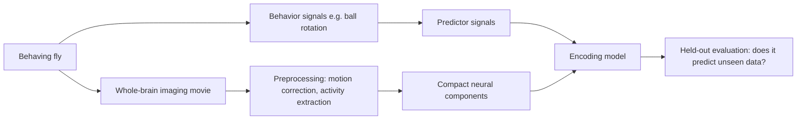
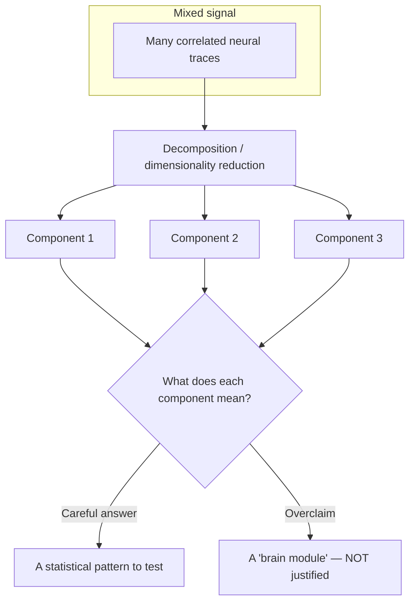
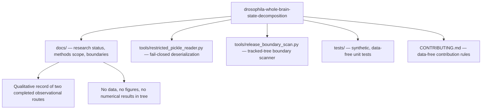

# Extended Introduction: Whole-Brain Activity, Brain States, and Why Safeguards Matter

*This document assumes zero neuroscience background. It explains the ideas behind this repository using everyday analogies, and it stays faithful to what the repository actually contains: a qualitative record of two completed, separate observational analyses, plus data-free safety tooling. For the shorter scientific summary, see [Introduction for new readers](INTRODUCTION.md).*

## 1. Watching a whole fly brain while the fly behaves

The fruit fly *Drosophila melanogaster* has a brain small enough that modern microscopes can record activity from very large portions of it at once — in some preparations, nearly the whole brain or central nervous system — while the animal is alive and behaving.[2][3] Think of it like a stadium at night: instead of interviewing one fan at a time, you point a camera at the entire crowd and watch the wave of light and movement ripple across all the seats simultaneously. Each "fan" is a neuron (or a small group of neurons), and the "light" is a fluorescent signal that brightens when a neuron is active.

In a common setup, the fly's head is held still under a two-photon microscope while its legs walk on an air-supported ball; the ball's rotation is a proxy for how the fly is trying to move.[7] Other work maps locomotion-related activity across the whole fly brain,[6] or relates brain-wide activity to walking and to metabolic state.[12][13]

Here is the catch: the raw recording is not a tidy spreadsheet of neurons. It is a huge, noisy movie — thousands of pixels or regions changing over time, all correlated with each other and with whatever the fly is doing. Turning that movie into science requires *analysis methods*, and every method carries assumptions. This repository exists at the intersection of that scientific ambition and a conservative engineering discipline: it records two completed, bounded observational analyses and provides **data-free safety tooling** (`tools/`) so that nothing outside the public-release boundary leaks into the shared code.

## 2. Brain "states": the radio-station idea

Brains do not run one flat program. They switch between *modes*: alert versus drowsy, moving versus resting, exploring versus freezing. A useful analogy is a car radio. The radio hardware is fixed, but at any moment it is tuned to one station — one pattern of sound — and it can hop between stations over time. Similarly, researchers describe the brain as moving between **states**: recurring, distinguishable patterns of whole-brain activity that correlate with behavior or internal conditions. Work in adult flies has, for example, described a global change in brain state during spontaneous and forced walking, composed of combined activity patterns of different neuron classes.[12]

A state is a *description*, not an organ. Saying "the brain entered a walking state" is like saying "the radio is on the jazz station" — it summarizes what is playing right now. It does not by itself identify a switch, a wire, or a cause.

## 3. State decomposition: the cocktail-party problem

The measured brain movie is a *mixture*: many underlying patterns are blended together in every pixel, the way many conversations blend into one wall of sound at a cocktail party. **State decomposition** is the family of techniques that tries to separate a mixed signal into simpler source patterns — the statistical version of picking one voice out of the crowd.

The classical entry point is **dimensionality reduction**: methods such as principal component analysis (PCA) find a small set of recurring patterns ("components") that together summarize most of the variation in thousands of correlated measurements.[4] A component is a compact statistical pattern. It is *useful* — it compresses the movie into a handful of traces you can plot and model — but it is **not automatically a neuron type, a circuit, a biological state, or a mechanism**.[4] That interpretive humility is a core value of this repository.

## 4. Encoding models and held-out evaluation

Once you have components, you can ask a *predictive* question: do behavioral signals — such as motion-related signals derived from the fly's movement, or annotation-related signals describing what happened in an experiment — help predict neural components?

An **encoding model** maps predictors onto neural signals. The gold-standard check is **held-out evaluation**: fit the model on one part of the data, then test it on a separate part it has never seen. If the relationship only exists in the fitting data, the model memorized noise ("overfitting"); if it transfers, you have a genuine, bounded predictive association. Crucially, if any model choices were tuned, those choices must be kept *inside* the validation loop, or the estimated error will be optimistically biased.[11] And prediction is not explanation: a model can predict well without telling you anything about cause or mechanism.[5][15]

This is exactly the shape of the two completed analyses recorded in this repository:

- A **component–motion encoding route**, which found a limited held-out association in the eligible animals; its annotation-related evidence was heterogeneous, and combined predictors were not uniformly better than motion-related predictors.
- A **separate observational prediction route**, which was non-supportive overall for its own question: its held-out improvement relative to a fixed baseline was directionally mixed.

The routes are deliberately **kept separate and not pooled**; neither is a replication of the other, and together they do not establish causality, a common neural state, learning, a shared mechanism, or a cross-system conclusion.

## 5. Why safeguards for time-series methods matter

Neural and behavioral recordings are **time series**: each measurement is correlated with its neighbors in time (autocorrelation). This creates a trap. Randomly shuffling or splitting such data can leave near-duplicate points on both sides of a train/test boundary, so "held-out" performance can be inflated and false discoveries become likely. Standard statistical tests also assume independence between observations — an assumption autocorrelated time series routinely violate. This is why the methodology literature stresses that description, prediction, association, and causal inference are distinct tasks with distinct safeguards.[15]

This repository embodies that caution in two concrete ways:

1. **Interpretive safeguards in the documentation.** Every outcome statement is bounded: observational and predictive only, no causal claims, no pooling across routes, supportive and non-supportive results both preserved.
2. **Engineering safeguards in `tools/`.** The public tree is *data-free*: it contains no recordings, no derived artifacts, no result-bearing files. A release-boundary scanner (`tools/release_boundary_scan.py`) checks Git-tracked paths and text against excluded categories (data files, archives, notebooks, network addresses, outcome-style claims), and a fail-closed deserialization utility (`tools/restricted_pickle_reader.py`) refuses to reconstruct pickle objects that reference external code. Their tests in `tests/` are fully synthetic.

## 6. What is actually in this repository

There is deliberately **no data-processing pipeline** in the public tree. The methods scope document states that any future implementation should remain data-free until the owner approves a separately governed input interface, and tests must use synthetic fixtures that do not resemble research outputs.

## 7. Key math, in one plain sentence each

These are the mathematical ideas the project actually relies on — the decomposition and evaluation concepts named in its documentation, plus the checking logic implemented in its tools.

- **Principal component analysis / dimensionality reduction:** rotate the cloud of data points so the first few axes capture the most shared variation, compressing thousands of traces into a few components.[4] Learn more: [StatQuest — PCA](https://www.youtube.com/watch?v=FgakZw6K1QQ), [3Blue1Brown — Linear algebra series](https://www.youtube.com/playlist?list=PLZHQObOWTQDPD3MizzM2xVFitgF8hE_ab).
- **Encoding (regression) model:** predict each neural component as a weighted combination of behavioral predictors, choosing weights that minimize prediction error on training data. Learn more: [StatQuest — Linear regression](https://www.youtube.com/watch?v=nk2CQITm_eo), [Khan Academy — Regression](https://www.khanacademy.org/math/statistics-probability/describing-relationships-quantitative-data).
- **Held-out / cross-validation evaluation:** fit on one subset, score on a disjoint subset, and keep every tuning choice inside the loop so the error estimate is honest.[11] Learn more: [StatQuest — Cross validation](https://www.youtube.com/watch?v=fSytzGwwBVw), [Seeing Theory](https://seeing-theory.brown.edu/).
- **Autocorrelation:** neighboring time points resemble each other, so naive independence assumptions fail and null tests must respect temporal structure (for example via permutation or circular-shift surrogates rather than parametric defaults). Learn more: [Khan Academy — Correlation](https://www.khanacademy.org/math/statistics-probability/describing-relationships-quantitative-data/scatterplots-and-correlation/v/correlation-and-causality).
- **Regular-expression pattern matching (used verbatim in `tools/release_boundary_scan.py`):** a declarative pattern language that flags prohibited strings — network addresses, DOI-like identifiers, outcome-style phrasing — in tracked text. Learn more: [Python `re` documentation](https://docs.python.org/3/library/re.html).
- **Exit-status discipline (implemented in the scanner's `main`):** encode outcomes as integers — 0 for clean, 1 for violations found, 2 when Git cannot list tracked files — so automation can react without parsing prose.

## 8. Reading the rest of the repository

Start with the README's research-status table, then the [Introduction](INTRODUCTION.md) for the scientific framing and verified references, then [Current results and discussion](CURRENT_RESULTS_AND_DISCUSSION.md) for the bounded outcomes, and [Release boundary](RELEASE_BOUNDARY.md) for what may and may not appear in this tree. Contributors should also read [Methods for contributors](METHODS.md), which explains which checks are already done and which remain open.

## Citation provenance

All numbered references below are carried over from the repository's own verified reference list in [INTRODUCTION.md](INTRODUCTION.md); no new empirical citations are introduced here.

## References

[2]: https://doi.org/10.1371/journal.pbio.2006732 "Aimon et al. (2019), Fast near-whole-brain imaging in adult Drosophila during responses to stimuli and behavior"
[3]: https://doi.org/10.1038/ncomms8924 "Lemon et al. (2015), Whole-central nervous system functional imaging in larval Drosophila"
[4]: https://doi.org/10.1038/nn.3776 "Cunningham and Yu (2014), Dimensionality reduction for large-scale neural recordings"
[5]: https://doi.org/10.1214/10-STS330 "Shmueli (2010), To explain or to predict?"
[6]: https://doi.org/10.1016/j.cub.2023.12.063 "Brezovec et al. (2024), Mapping the neural dynamics of locomotion across the Drosophila brain"
[7]: https://doi.org/10.1038/nmeth.1468 "Seelig et al. (2010), Two-photon calcium imaging from head-fixed Drosophila during optomotor walking behavior"
[11]: https://doi.org/10.1186/1471-2105-7-91 "Varma and Simon (2006), Bias in error estimation when using cross-validation for model selection"
[12]: https://doi.org/10.7554/eLife.85202 "Aimon et al. (2023), Global change in brain state during spontaneous and forced walk in Drosophila"
[13]: https://doi.org/10.1038/s41586-021-03497-0 "Mann et al. (2021), Coupling of activity, metabolism and behaviour across the Drosophila brain"
[15]: https://doi.org/10.1098/rspb.2020.2815 "Laubach et al. (2021), A biologist's guide to model selection and causal inference"
