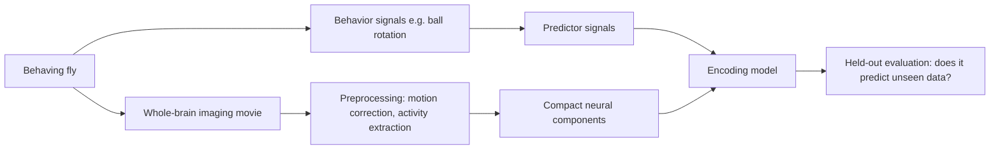
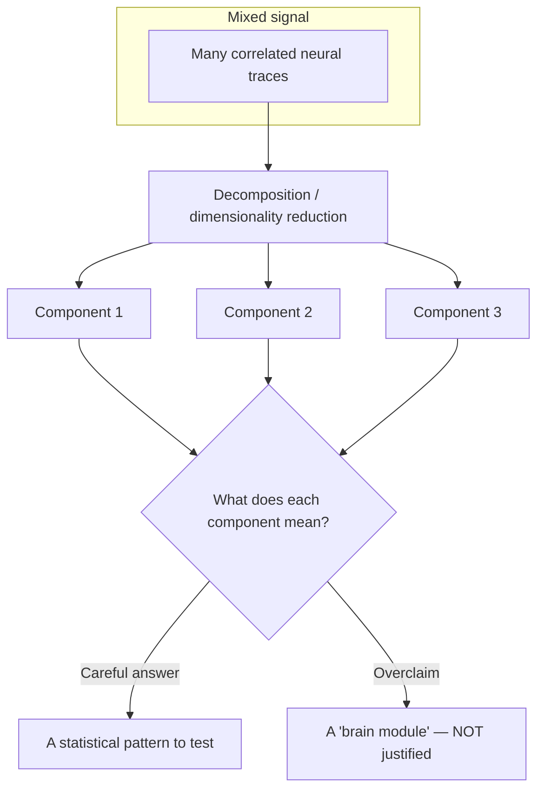
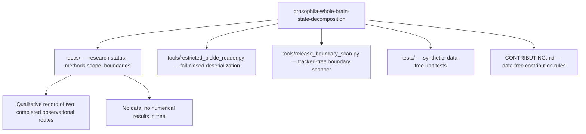

# Extended Introduction: Whole-Brain Activity, Brain States, and Why Safeguards Matter

*This document assumes zero neuroscience background — and zero mathematical background. Every quantitative idea is first carried out as an explicit, finite procedure on a handful of numbers you could check with pencil and paper, and only then given its technical name. No equations of motion, no calculus, no axioms anywhere. The document stays faithful to what the repository actually contains: a qualitative record of two completed, separate observational analyses, plus data-free safety tooling. For the shorter scientific summary with full citations, see [Introduction for new readers](INTRODUCTION.md).*

**Concept figure.** The analysis shape documented here — brain-wide movie, decomposition into components, an encoding model, and the held-out verdict that decides what may be claimed — is drawn in [concept_figure.md](concept_figure.md) as an embedded Mermaid diagram. (The release boundary does not allow image files in the tracked tree, so the figure lives as text.)

## 1. Watching a whole fly brain while the fly behaves

The fruit fly *Drosophila melanogaster* has a brain small enough that modern microscopes can record activity from very large portions of it at once — in some preparations, nearly the whole brain or central nervous system — while the animal is alive and behaving (Aimon et al. 2019; Lemon et al. 2015 — reference [2][3] in [INTRODUCTION.md](INTRODUCTION.md)). Think of it like a stadium at night: instead of interviewing one fan at a time, you point a camera at the entire crowd and watch the wave of light and movement ripple across all the seats simultaneously. Each "fan" is a neuron (or a small group of neurons), and the "light" is a fluorescent signal that brightens when a neuron is active.

In a common setup, the fly's head is held still under a two-photon microscope while its legs walk on an air-supported ball; the ball's rotation is a proxy for how the fly is trying to move (Seelig et al. 2010 [7]). Other work maps locomotion-related activity across the whole fly brain (Brezovec et al. 2024 [6]), or relates brain-wide activity to walking and to metabolic state (Aimon et al. 2023 [12]; Mann et al. 2021 [13]).

Here is the catch: the raw recording is not a tidy spreadsheet of neurons. It is a huge, noisy movie — thousands of pixels or regions changing over time, all correlated with each other and with whatever the fly is doing. Turning that movie into science requires *analysis methods*, and every method carries assumptions. This repository exists at the intersection of that scientific ambition and a conservative engineering discipline: it records two completed, bounded observational analyses and provides **data-free safety tooling** (`tools/`) so that nothing outside the public-release boundary leaks into the shared code.

## 2. Brain "states": the radio-station idea

Brains do not run one flat program. They switch between *modes*: alert versus drowsy, moving versus resting, exploring versus freezing. A useful analogy is a car radio. The radio hardware is fixed, but at any moment it is tuned to one station — one pattern of sound — and it can hop between stations over time. Similarly, researchers describe the brain as moving between **states**: recurring, distinguishable patterns of whole-brain activity that correlate with behavior or internal conditions. Work in adult flies has described a global change in brain state during spontaneous and forced walking, composed of combined activity patterns of different neuron classes (Aimon et al. 2023 [12]).

A state is a *description*, not an organ. Saying "the brain entered a walking state" is like saying "the radio is on the jazz station" — it summarizes what is playing right now. It does not by itself identify a switch, a wire, or a cause. In the same spirit, **"the state is just the list of numbers you need to remember to predict what happens next"** — nothing more metaphysical than that.

## 3. State decomposition: the cocktail-party problem, done by hand

The measured brain movie is a *mixture*: many underlying patterns are blended together in every region, the way many conversations blend into one wall of sound at a cocktail party. **State decomposition** is the family of techniques that tries to separate a mixed signal into simpler source patterns — the statistical version of picking one voice out of the crowd.

The classical entry point is **dimensionality reduction**: methods such as principal component analysis (PCA) find a small set of recurring patterns ("components") that together summarize most of the variation in thousands of correlated measurements (Cunningham and Yu 2014 [4]). What does that mean concretely? Here is the entire idea on six numbers. Suppose two recorded traces move together across three time bins:

| Bin | Trace 1 | Trace 2 |
|---|---|---|
| 1 | 2 | 4 |
| 2 | 3 | 6 |
| 3 | 4 | 8 |

Trace 2 is always exactly double trace 1, so the pair carries only *one* piece of information, not two. A dimensionality-reduction procedure notices this systematically: instead of remembering six numbers, remember one shared pattern — "trace 2 = 2 × trace 1" — plus one value per bin (2, 3, 4). You compressed six numbers into three plus a rule. PCA is exactly this compression, carried out by a fixed sequence of averaging and rotation steps, for the case where the match is approximate rather than perfect. Nothing infinitary is involved: it is a finite list of arithmetic operations applied to a finite table.

A component produced this way is a compact statistical pattern. It is *useful* — it compresses the movie into a handful of traces you can plot and model — but it is **not automatically a neuron type, a circuit, a biological state, or a mechanism** (Cunningham and Yu 2014 [4]). That interpretive humility is a core value of this repository.

## 4. Encoding models and held-out evaluation, as arithmetic

Once you have components, you can ask a *predictive* question: do behavioral signals — such as motion-related signals derived from the fly's movement, or annotation-related signals describing what happened in an experiment — help predict neural components?

An **encoding model** is, mechanically, a weighted sum. Suppose we suspect a neural component is roughly "2 × motion + 1". Fitting the model means choosing those weights (the 2 and the 1) so predictions land close to the measurements *on a training portion*. Here is a full fit-and-test cycle on four made-up time bins, with candidate weights 2 and 1:

| Bin | Motion | Component (actual) | Prediction = 2 × motion + 1 | Miss = actual − prediction |
|---|---|---|---|---|
| 1 | 1.0 | 2.9 | 3.0 | −0.1 |
| 2 | 2.0 | 5.2 | 5.0 | 0.2 |
| 3 | 0.5 | 1.8 | 2.0 | −0.2 |
| 4 | 3.0 | 7.5 | 7.0 | 0.5 |

The misses are small, so these weights describe this tiny table well. Choosing weights to make the misses small — exactly this trial-and-error, systematized — is all "fitting a regression" means.

The gold-standard check is **held-out evaluation**: fit the weights on bins 1–2 only, then score them on bins 3–4, which the fitting procedure never saw. If the relationship only exists in the fitting data, the model memorized noise ("overfitting"); if it transfers, you have a genuine, bounded predictive association. Crucially, if any model choices were tuned, those choices must be kept *inside* the validation loop, or the estimated error will be optimistically biased (Varma and Simon 2006 [11]). And prediction is not explanation: a model can predict well without telling you anything about cause or mechanism (Shmueli 2010 [5]; Laubach et al. 2021 [15]).

This is exactly the shape of the two completed analyses recorded in this repository:

- A **component–motion encoding route**, which found a limited held-out association in the eligible animals; its annotation-related evidence was heterogeneous, and combined predictors were not uniformly better than motion-related predictors.
- A **separate observational prediction route**, which was non-supportive overall for its own question: its held-out improvement relative to a fixed baseline was directionally mixed.

The routes are deliberately **kept separate and not pooled**; neither is a replication of the other, and together they do not establish causality, a common neural state, learning, a shared mechanism, or a cross-system conclusion.

## 5. Why safeguards for time-series methods matter

Neural and behavioral recordings are **time series**: each measurement is correlated with its neighbors in time (autocorrelation). This creates a trap. If you split such a series randomly into "train" and "test," neighboring — nearly identical — points land on both sides of the boundary, so the "held-out" score is inflated and false discoveries become likely. You can see the trap in the table above: bin 3 is close to bin 2 simply because time moved one step, whatever the underlying process. Standard statistical shortcuts also assume observations are independent — an assumption autocorrelated time series routinely violate. This is why the methodology literature stresses that description, prediction, association, and causal inference are distinct tasks with distinct safeguards (Laubach et al. 2021 [15]).

This repository embodies that caution in two concrete ways:

1. **Interpretive safeguards in the documentation.** Every outcome statement is bounded: observational and predictive only, no causal claims, no pooling across routes, supportive and non-supportive results both preserved.
2. **Engineering safeguards in `tools/`.** The public tree is *data-free*: it contains no recordings, no derived artifacts, no result-bearing files. A release-boundary scanner (`tools/release_boundary_scan.py`) checks Git-tracked paths and text against excluded categories (data files, archives, notebooks, network addresses, identifier-style references, outcome-style claims), and a fail-closed deserialization utility (`tools/restricted_pickle_reader.py`) refuses to reconstruct pickle objects that reference external code. Their tests in `tests/` are fully synthetic.

## 6. What is actually in this repository

There is deliberately **no data-processing pipeline** in the public tree. The methods scope document states that any future implementation should remain data-free until the owner approves a separately governed input interface, and tests must use synthetic fixtures that do not resemble research outputs.

## 7. Key ideas, in one plain sentence each

These are the quantitative ideas the project actually relies on, restated as procedures. The named learning resources are free; search for them by title.

- **Dimensionality reduction (PCA):** compress a table of correlated traces into a few shared patterns plus per-bin values — the six-number example in section 3 is the whole idea. *(Learn: the StatQuest video on PCA; the 3Blue1Brown series Essence of Linear Algebra.)*
- **Encoding (regression) model:** predict each neural component as a weighted sum of behavioral predictors, choosing weights that make misses small on training data — the four-bin table in section 4. *(Learn: the StatQuest video on linear regression; the Khan Academy unit on describing quantitative relationships.)*
- **Held-out / cross-validation evaluation:** fit on one subset, score on a disjoint subset, and keep every tuning choice inside the loop so the error estimate is honest. *(Learn: the StatQuest video on cross validation; the Seeing Theory interactive chapters.)*
- **Autocorrelation:** neighboring time points resemble each other, so naive independence assumptions fail and shuffled comparisons must respect time order (for example, shifting the whole series circularly rather than scrambling it). *(Learn: the Khan Academy unit on correlation.)*
- **Pattern matching with regular expressions (used verbatim in `tools/release_boundary_scan.py`):** a declarative pattern language that flags prohibited strings — network addresses, identifier-style references, outcome-style phrasing — in tracked text. *(Learn: the Python documentation for the re module.)*
- **Exit-status discipline (implemented in the scanner's `main`):** encode outcomes as integers — 0 for clean, 1 for violations found, 2 when Git cannot list tracked files — so automation can react without parsing prose.

## 8. Reading the rest of the repository

Start with the README's research-status table, then the [Introduction](INTRODUCTION.md) for the scientific framing and verified references, then [Current results and discussion](CURRENT_RESULTS_AND_DISCUSSION.md) for the bounded outcomes, and [Release boundary](RELEASE_BOUNDARY.md) for what may and may not appear in this tree. Contributors should also read [Methods for contributors](METHODS.md), which explains which checks are already done and which remain open.

## Citation provenance

All literature citations above refer to the numbered, verified reference list in [INTRODUCTION.md](INTRODUCTION.md), which is the repository's single citable source list. The entries used here are: Aimon et al. 2019 [2]; Lemon et al. 2015 [3]; Cunningham and Yu 2014 [4]; Shmueli 2010 [5]; Brezovec et al. 2024 [6]; Seelig et al. 2010 [7]; Varma and Simon 2006 [11]; Aimon et al. 2023 [12]; Mann et al. 2021 [13]; Laubach et al. 2021 [15]. Per the release boundary, this document contains no external addresses or identifier links — find each source by author, year, and title. No citations beyond that list are made in this document.
