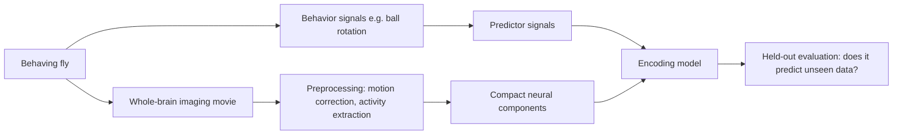
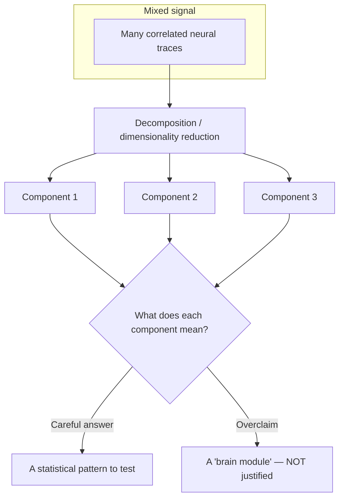
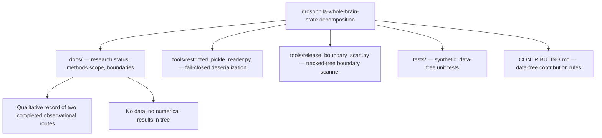

# Extended Introduction: Whole-Brain Activity, Brain States, and Why Safeguards Matter

*This document assumes zero neuroscience background — and zero mathematical background. Every quantitative idea is first carried out as an explicit, finite procedure on a handful of numbers you could check with pencil and paper, and only then given its technical name. No equations of motion, no calculus, no axioms anywhere. The document stays faithful to what the repository actually contains: a qualitative record of two completed, separate observational analyses, plus data-free safety tooling. For the shorter scientific summary with the full literature list, see [Introduction for new readers](INTRODUCTION.md).*

Because there is never only one way to understand an idea, each core concept below ends with a **"many roads"** subsection: several independent mathematical lenses on the same concept, each with one tiny fully-worked example. Take whichever road matches your intuition and skip the rest — all of them arrive at the same place, and none needs anything beyond counting, sets, and tables.

**Concept figure.** The analysis shape documented here — brain-wide movie, decomposition into components, an encoding model, and the held-out verdict that decides what may be claimed — is drawn in [concept_figure.md](concept_figure.md) as an embedded Mermaid diagram. (The release boundary does not allow image files in the tracked tree, so the figure lives as text.)

## Start here: the math toolkit from zero

Every mathematical object used in this document is defined right here — three plain sentences or fewer each, plus one tiny numeric example checkable by hand. No schooling assumed; if a symbol later looks strange, return to this section.

- **Variable.** A variable is a named slot that holds a number, like a labeled jar. The label stays while the contents change. Example: let $x$ hold 2; after one step it may hold 3, still in the jar called $x$.
- **Subscript.** A subscript is a position label on a letter: $x_3$ means "the $x$-value at time (or position) 3." One letter then names a whole list. Example: if a trace reads 2, 3, 4 across three bins, then $x_1 = 2$, $x_2 = 3$, $x_3 = 4$.
- **Function.** A function is a machine with one fixed rule: feed it a number, it returns a number. $f(x)$ means "the machine's output when fed $x$." Example: $f(x) = 2x + 1$ gives $f(1) = 3$ and $f(3) = 7$.
- **Set, membership, partition.** A set is a collection of distinct things in curly braces; $\in$ means "is a member of." A **partition** divides a set into non-overlapping piles covering everything. Example: partitioning $\{1,2,3,4\}$ into $\{1,4\}$ and $\{2,3\}$ puts every member in exactly one pile, and $3 \in \{2,3\}$.
- **Intersection and disjointness.** The intersection $A \cap B$ is the set of members shared by $A$ and $B$; two sets are disjoint when the intersection is empty ($\emptyset$). Example: $\{1,2\} \cap \{3,4\} = \emptyset$, so training bins $\{1,2\}$ and test bins $\{3,4\}$ share nothing.
- **Sum, the symbol $\sum$.** The symbol $\sum$ means "add up everything in this range"; the labels below and above say where counting starts and stops. Example: $\sum_{i=1}^{3} x_i = 2 + 3 + 4 = 9$.
- **Probability as a fraction of cases.** A probability is a count of favorable cases over a count of all cases, so it lies between 0 and 1. Example: if 6 of 8 fine-grained patterns count as "walking," $P(\text{walking}) = 6/8 = 0.75$.
- **Average (mean).** A mean is a total divided by how many items you added — the equal share. Example: the mean of 2, 3, 4 is $(2+3+4)/3 = 3$.
- **$\log_2$, the number of halvings.** $\log_2(n)$ asks how many times you can halve $n$ before reaching 1 — equivalently, how many yes/no questions pin down one of $n$ equally likely options. Example: $\log_2(4) = 2$, because $4 \to 2 \to 1$ is two halvings.
- **Vector and weighted sum.** A vector is an ordered list of numbers; a weighted sum multiplies each entry by a chosen weight and adds the results. Example: weights (2, 1) on the pair (3, 4) give $2 \times 3 + 1 \times 4 = 10$.
- **Graph (nodes plus edges).** A graph is dots (nodes) joined by arrows (edges); a chain graph joins each node to its temporal neighbors. Example: bins 1–2–3–4 form a chain with exactly 3 edges.
- **Fixed point.** A fixed point of a rule is a value the rule leaves unchanged — output equals input. Example: for "tomorrow $= 0.9 \times$ today $+ 1$," solving $x = 0.9x + 1$ gives $x = 10$, and indeed $0.9 \times 10 + 1 = 10$.
- **Feedback loop / iteration.** Iteration is applying one rule to its own output, repeatedly — each application is one row of a table. Example: starting at 1, the rule $0.9x + 1$ gives $1 \to 1.9 \to 2.71 \to \cdots$, walking toward the fixed point 10.
- **Indicator (checklist value).** $\mathbb{1}[\text{statement}]$ is a checker that returns 1 if the statement is true and 0 if false. It turns a yes/no test into a number you can add. Example: $\mathbb{1}[2 < 3] = 1$ and $\mathbb{1}[5 < 3] = 0$.

## 1. Watching a whole fly brain while the fly behaves

The fruit fly *Drosophila melanogaster* has a brain small enough that modern microscopes can record activity from very large portions of it at once — in some preparations, nearly the whole brain or central nervous system — while the animal is alive and behaving (references [2] and [3] in [INTRODUCTION.md](INTRODUCTION.md)). Think of it like a stadium at night: instead of interviewing one fan at a time, you point a camera at the entire crowd and watch the wave of light and movement ripple across all the seats simultaneously. Each "fan" is a neuron (or a small group of neurons), and the "light" is a fluorescent signal that brightens when a neuron is active.

In a common setup, the fly's head is held still under a microscope while its legs walk on an air-supported ball; the ball's rotation is a proxy for how the fly is trying to move (reference [7]). Other work maps locomotion-related activity across the whole fly brain (reference [6]), or relates brain-wide activity to walking and to metabolic state (references [12] and [13]).

Here is the catch: the raw recording is not a tidy spreadsheet of neurons. It is a huge, noisy movie — thousands of pixels or regions changing over time, all correlated with each other and with whatever the fly is doing. Turning that movie into science requires *analysis methods*, and every method carries assumptions. This repository exists at the intersection of that scientific ambition and a conservative engineering discipline: it records two completed, bounded observational analyses and provides **data-free safety tooling** (`tools/`) so that nothing outside the public-release boundary leaks into the shared code.

## 2. Brain "states": the radio-station idea

Brains do not run one flat program. They switch between *modes*: alert versus drowsy, moving versus resting, exploring versus freezing. A useful analogy is a car radio. The radio hardware is fixed, but at any moment it is tuned to one station — one pattern of sound — and it can hop between stations over time. Similarly, researchers describe the brain as moving between **states**: recurring, distinguishable patterns of whole-brain activity that correlate with behavior or internal conditions. Work in adult flies has described a global change in brain state during spontaneous and forced walking, composed of combined activity patterns of different neuron classes (reference [12]).

A state is a *description*, not an organ. Saying "the brain entered a walking state" is like saying "the radio is on the jazz station" — it summarizes what is playing right now. It does not by itself identify a switch, a wire, or a cause. In the same spirit, **"the state is just the list of numbers you need to remember to predict what happens next"** — nothing more metaphysical than that.

### The many roads to a brain state

**Road 1: set theory.** Divide the set of all observed activity patterns into subsets, and call each subset a state: the walking subset, the resting subset. "The brain is in the walking state" is a membership statement — the current pattern belongs to the walking subset. Worked example: record 10 moments, score each on two features (motion-related, annotation-related), and sort them into two piles by which feature is larger: pile W = {moments 1, 3, 4, 8}, pile R = {moments 2, 5, 6, 7, 9, 10}. Declaring two states is exactly declaring this partition. Formally,

$$W = \{1, 3, 4, 8\}, \quad R = \{2, 5, 6, 7, 9, 10\}, \qquad W \cup R = \{1, \ldots, 10\}, \quad W \cap R = \emptyset$$

where $W \cup R$ is the union (every moment lands in some pile) and $W \cap R = \emptyset$ says no moment sits in both — "two states" is exactly these two set facts about the worked piles. *What this buys you:* total clarity about what a state label commits you to — a partition, nothing more. *What it costs you:* sets have hard borders; a moment sitting on the boundary is forced into one pile, hiding the ambiguity.

**Road 2: automata.** Model the brain as a finite-state machine with a transition table: from "resting," the inputs {leg movement starts} move it to "walking"; from "walking," {movement stops for 5 s} moves it back. Worked example with 2 states and a binary input: the table is (resting, 1) → walking; (resting, 0) → resting; (walking, 0) → resting; (walking, 1) → walking — four rows, and the entire state history of an experiment is the machine replayed on the input tape 0, 1, 1, 0, 0: resting → walking → walking → resting → resting. Formally the machine is a transition rule $\delta$,

$$\delta(\text{resting}, 1) = \text{walking}, \quad \delta(\text{resting}, 0) = \text{resting}, \quad \delta(\text{walking}, 0) = \text{resting}, \quad \delta(\text{walking}, 1) = \text{walking}$$

where $\delta(\text{state}, \text{input})$ gives the next state, and replaying the tape 0, 1, 1, 0, 0 through these four rows reproduces exactly the worked state history. *What this buys you:* states as something you can simulate and test row by row; "hysteresis" is just asymmetric rows. *What it costs you:* the machine forces you to pre-declare how many states exist, which is often the very thing you wanted to discover.

**Road 3: information theory by counting.** A state label is valuable exactly when it answers questions about the future. If behavior is equally likely to be any of 4 types, naming the behavior costs $\log_2(4) = 2$ yes/no questions; if knowing "the state is walking" always tells you the behavior, the state label answers all 2 questions. If it narrows 4 options to 2, it answers 2 − 1 = 1 question. Formally, the label's worth is a difference of question-counts,

$$\text{value} = \log_2(\text{options before}) - \log_2(\text{options after}) = \log_2(4) - \log_2(2) = 2 - 1 = 1 \text{ question}$$

where the first term is the question-cost without the label and the second with it — the 1-question difference is exactly the worked narrowing from 4 options to 2. *What this buys you:* a countable yardstick for "how much does this state label actually tell me" — labels that answer zero questions are decoration. *What it costs you:* the count depends on the set of behaviors you chose to distinguish; a different choice changes the verdict.

**Road 4: statistical mechanics by counting.** A state can be a *macrostate*: a big collection of microscopic activity patterns that all count as "the same" for the observer's purpose. "Walking state" is then the macrostate containing every fine-grained pattern compatible with walking, and its size — how many microstates it absorbs — is its multiplicity. Worked example: 8 possible fine-grained patterns; if 6 of them are grouped as "walking" and 2 as "resting," then an unlabeled glance at the brain lands in "walking" 6 of 8 times. The state you typically observe is simply the most populated macrostate. Formally, the chance of an unlabeled glance landing in a state is its multiplicity as a fraction of cases,

$$P(\text{walking}) = \frac{\Omega(\text{walking})}{\Omega(\text{all})} = \frac{6}{8} = 0.75$$

where $\Omega(\text{walking}) = 6$ counts the microstates grouped as walking and $\Omega(\text{all}) = 8$ counts them all — the observed dominance of "walking" is this one fraction. *What this buys you:* why coarse labels dominate reports — they cover the most cases. *What it costs you:* multiplicity is about abundance, not importance; a rare macrostate can still carry the interesting biology.

## 3. State decomposition: the cocktail-party problem, done by hand

The measured brain movie is a *mixture*: many underlying patterns are blended together in every region, the way many conversations blend into one wall of sound at a cocktail party. **State decomposition** is the family of techniques that tries to separate a mixed signal into simpler source patterns — the statistical version of picking one voice out of the crowd.

The classical entry point is **dimensionality reduction**: methods such as principal component analysis (PCA) find a small set of recurring patterns ("components") that together summarize most of the variation in thousands of correlated measurements (reference [4]). What does that mean concretely? Here is the entire idea on six numbers. Suppose two recorded traces move together across three time bins:

| Bin | Trace 1 | Trace 2 |
|---|---|---|
| 1 | 2 | 4 |
| 2 | 3 | 6 |
| 3 | 4 | 8 |

Trace 2 is always exactly double trace 1, so the pair carries only *one* piece of information, not two. A dimensionality-reduction procedure notices this systematically: instead of remembering six numbers, remember one shared pattern — "trace 2 = 2 × trace 1" — plus one value per bin (2, 3, 4). You compressed six numbers into three plus a rule. PCA is exactly this compression, carried out by a fixed sequence of averaging and rotation steps, for the case where the match is approximate rather than perfect. Nothing infinitary is involved: it is a finite list of arithmetic operations applied to a finite table. Formally, the compression writes each trace as a multiple of one component,

$$\text{trace}_1(t) = 1 \cdot c_t, \qquad \text{trace}_2(t) = 2 \cdot c_t, \qquad \text{with } c_1 = 2,\ c_2 = 3,\ c_3 = 4$$

where $c_t$ is the single component's value at bin $t$ and the multipliers 1 and 2 are the mixing proportions — at bin 2 this gives $(1 \times 3,\ 2 \times 3) = (3, 6)$, exactly the middle row of the table.

A component produced this way is a compact statistical pattern. It is *useful* — it compresses the movie into a handful of traces you can plot and model — but it is **not automatically a neuron type, a circuit, a biological state, or a mechanism** (reference [4]). That interpretive humility is a core value of this repository.

### The many roads to decomposition

**Road 1: geometry — projection as casting a shadow.** Each time bin's measurements are a point in a high-dimensional space (one axis per trace), and a component is a direction; decomposition is viewing the shadow the cloud of points casts along a few chosen directions. Worked example in 2D: the points (2,4), (3,6), (4,8) all lie exactly on the line "second coordinate = 2 × first," so their shadows along that line — at positions 2, 3, 4 — keep all the information, while the shadows on the perpendicular line are all zero and can be discarded. Formally, the shadow position of a point $(x, y)$ on the line of direction $(1, 2)$ is the scaled coordinate

$$\text{shadow} = \frac{x \cdot 1 + y \cdot 2}{1^2 + 2^2}\,(1, 2), \qquad (2,4) \mapsto \frac{2 + 8}{5}(1,2) = 2 \cdot (1,2) = (2,4)$$

where the numerator measures how far along the line the point sits and dividing by $1^2 + 2^2 = 5$ corrects for the direction's length — the point (2,4) shadows onto itself because it lies exactly on the line, which is the "no information lost" case. *What this buys you:* compression as shadow-casting; lost variance is literally what falls outside the shadow. *What it costs you:* shadows mix sources — two different clouds can cast the same shadow, which is the geometric face of "a component is not a mechanism."

**Road 2: linear algebra as weight tables.** Each component is a row of mixing proportions, and each trace is rebuilt as a weighted sum of components. Worked example: component row (1, 2) means "trace 1 gets 1 share, trace 2 gets 2 shares"; with component value 3 at bin 2, the reconstruction is (3×1, 3×2) = (3, 6) — exactly the table above. The whole decomposition is two tables: one of mixing proportions, one of per-bin component values. Formally, reconstruction is a weighted sum,

$$\text{reconstruction}_j(t) = \sum_k w_{j,k}\, c_k(t), \qquad \text{trace}_2(2) = w_{2,1}\, c_1(2) = 2 \times 3 = 6$$

where $w_{j,k}$ is the proportion of component $k$ that goes into trace $j$ and $c_k(t)$ is the component's value at bin $t$ — one multiply-and-add rebuilds the (3, 6) row. *What this buys you:* the output as two inspectable tables; every reconstruction is checkable by one weighted sum. *What it costs you:* the tables do not record why those proportions were chosen — a different method hands you a different, equally lawful pair of tables.

**Road 3: information theory by counting.** Compression is question-saving. The raw table of 6 numbers, if each needs 3 yes/no questions, costs 18 questions; the compressed description (rule "double" plus 3 values) costs 1 + 9 = 10 questions — the redundancy saved 8. Worked count: if trace 2 must equal 2 × trace 1, then after naming trace 1's value (3 questions), trace 2 costs 0 further questions; over 3 bins that is 9 questions instead of 18. Formally,

$$\text{cost}_{\text{raw}} = 6 \times 3 = 18, \qquad \text{cost}_{\text{compressed}} = 1 + 3 \times 3 = 10, \qquad \text{savings} = 18 - 10 = 8 \text{ questions}$$

where each term is a question-count from the worked tally — the 8-question savings is the countable content of "the traces are redundant." *What this buys you:* a precise sense in which correlated traces carry less information than they appear to. *What it costs you:* question-counting says how much you saved, not whether the savings destroyed the one detail that mattered biologically.

## 4. Encoding models and held-out evaluation, as arithmetic

Once you have components, you can ask a *predictive* question: do behavioral signals — such as motion-related signals derived from the fly's movement, or annotation-related signals describing what happened in an experiment — help predict neural components?

An **encoding model** is, mechanically, a weighted sum. Suppose we suspect a neural component is roughly "2 × motion + 1". Fitting the model means choosing those weights (the 2 and the 1) so predictions land close to the measurements *on a training portion*. Here is a full fit-and-test cycle on four made-up time bins, with candidate weights 2 and 1:

| Bin | Motion | Component (actual) | Prediction = 2 × motion + 1 | Miss = actual − prediction |
|---|---|---|---|---|
| 1 | 1.0 | 2.9 | 3.0 | −0.1 |
| 2 | 2.0 | 5.2 | 5.0 | 0.2 |
| 3 | 0.5 | 1.8 | 2.0 | −0.2 |
| 4 | 3.0 | 7.5 | 7.0 | 0.5 |

The misses are small, so these weights describe this tiny table well. Choosing weights to make the misses small — exactly this trial-and-error, systematized — is all "fitting a regression" means. Formally the model and its miss are

$$\hat{y}_t = w\, x_t + b, \qquad e_t = y_t - \hat{y}_t, \qquad \hat{y}_1 = 2 \times 1.0 + 1 = 3.0, \quad e_1 = 2.9 - 3.0 = -0.1$$

where $x_t$ is the motion value, $w = 2$ and $b = 1$ the chosen weights, $\hat{y}_t$ the prediction, and $e_t$ the miss — the first row of the table computed by the formula, and fitting means choosing $w$ and $b$ so the misses $e_t$ stay small.

The gold-standard check is **held-out evaluation**: fit the weights on bins 1–2 only, then score them on bins 3–4, which the fitting procedure never saw. If the relationship only exists in the fitting data, the model memorized noise ("overfitting"); if it transfers, you have a genuine, bounded predictive association. Crucially, if any model choices were tuned, those choices must be kept *inside* the validation loop, or the estimated error will be optimistically biased (reference [11]). And prediction is not explanation: a model can predict well without telling you anything about cause or mechanism (references [5] and [15]).

This is exactly the shape of the two completed analyses recorded in this repository:

- A **component–motion encoding route**, which found a limited held-out association in the eligible animals; its annotation-related evidence was heterogeneous, and combined predictors were not uniformly better than motion-related predictors.
- A **separate observational prediction route**, which was non-supportive overall for its own question: its held-out improvement relative to a fixed baseline was directionally mixed.

The routes are deliberately **kept separate and not pooled**; neither is a replication of the other, and together they do not establish causality, a common neural state, learning, a shared mechanism, or a cross-system conclusion.

### The many roads to held-out evaluation

**Road 1: probability as frequencies.** Build a 2×2 tally over many fits: rows = "weights chosen using the test bins?" (leak or no leak), columns = "did the model look good on the test bins?" With a leak, the counts pile into "looked good" regardless of truth — say 18 of 20 leaky fits look good while only 2 reveal failure; without a leak, a memorizing model fails most of the time — say 3 look good, 17 fail. Held-out evaluation is the discipline of staying in the second row so the tally is honest. Formally the two rows are two conditional frequencies,

$$P(\text{looks good} \mid \text{leak}) = \frac{18}{20} = 0.9, \qquad P(\text{looks good} \mid \text{no leak}) = \frac{3}{20} = 0.15$$

where each is a row recount of the tally — the gap between 0.9 and 0.15 is the visible corruption a leak introduces. *What this buys you:* the harm of leakage as a visible skew in a table of counts. *What it costs you:* the tally tells you leakage corrupts conclusions, not how to design the split for a particular dataset.

**Road 2: game theory, memorizer versus generalizer.** Two players compete to impress you. The memorizer may study the answer key (all bins) and wins whenever the test rewards recall; the generalizer sees only training bins and wins only when the pattern is real. Held-out evaluation is the rule that levels the game: both players are scored on bins neither touched. Worked example with the four-bin table: memorizer fits bins 1–4 perfectly (misses all 0) but scores misses of 1.2 on fresh bins 5–6; generalizer's misses are 0.2 on training bins 1–2 and 0.3 on held-out bins 3–4 — nearly the same, which is the signature of an honest pattern. Formally, each player's score is an average miss over the held-out bins,

$$\text{score} = \frac{1}{|H|} \sum_{t \in H} |e_t|, \qquad \text{memorizer: } 1.2, \quad \text{generalizer: } \frac{0.2 + 0.3}{2} = 0.25$$

where $H$ is the held-out set, $|H|$ its size, and the sum averages the misses over it — the worked misses 0.2 and 0.3 give the generalizer 0.25, far below the memorizer's 1.2 on fresh bins. *What this buys you:* overfitting rephrased as "a player who studied the exam." *What it costs you:* real fitting procedures are not deliberate cheaters; the adversary is a metaphor for a statistical bias, not an accusation.

**Road 3: set theory.** Define the training set T and the test set H with the requirement T ∩ H = ∅. Every honest claim in this document is a statement about performance on H using knowledge only from T. The leakage bug of reference [11] is, in set language, letting information from H slip into the fitting procedure — the intersection was supposed to be empty and was not. Formally,

$$T = \{1, 2\}, \qquad H = \{3, 4\}, \qquad T \cap H = \emptyset$$

where the disjointness on the four worked bins is the entire safeguard, checkable at a glance. *What this buys you:* a one-line, checkable definition of the safeguard (disjointness) plus a vocabulary for its violations. *What it costs you:* disjointness of indices is easy; disjointness of *information* — the thing that matters — is subtler than any set notation.

## 5. Why safeguards for time-series methods matter

Neural and behavioral recordings are **time series**: each measurement is correlated with its neighbors in time (autocorrelation). This creates a trap. If you split such a series randomly into "train" and "test," neighboring — nearly identical — points land on both sides of the boundary, so the "held-out" score is inflated and false discoveries become likely. You can see the trap in the table above: bin 3 is close to bin 2 simply because time moved one step, whatever the underlying process. Standard statistical shortcuts also assume observations are independent — an assumption autocorrelated time series routinely violate. This is why the methodology literature stresses that description, prediction, association, and causal inference are distinct tasks with distinct safeguards (reference [15]).

### The many roads to autocorrelation

**Road 1: discrete iterated maps.** Autocorrelation is what the rule "tomorrow ≈ today" produces. Iterate tomorrow = 0.9 × today + 1, starting at 1: 1, 1.9, 2.7, 3.4, 4.1 — every value is within 1 of its predecessor, automatically. Now split these five values randomly into train {1, 2.7, 4.1} and test {1.9, 3.4}: each test value sits next to a training value it barely differs from, so any "prediction" looks brilliant while containing no skill. The inflation is manufactured by the map, and it cost us one multiplication per row to see it. Formally the map is

$$x_{t+1} = 0.9\, x_t + 1, \qquad x_0 = 1,\quad x_1 = 0.9 \times 1 + 1 = 1.9,\quad x_2 = 2.71 \approx 2.7$$

where each step multiplies by 0.9 and adds 1 — the worked sequence 1, 1.9, 2.7, … is this one line iterated, and $|x_{t+1} - x_t| \le 1$ at every step, which is the neighbor-similarity that inflates random splits. *What this buys you:* the trap as a generative recipe you can run — and the fix (split by contiguous blocks, or shift the series circularly) as a rule about *which* rows may be separated. *What it costs you:* the iterated-map view shows correlation persisting but not every real source of it (trends, slow drift).

**Road 2: graph theory.** Draw the time series as a chain graph: nodes are bins, edges join each bin to its temporal neighbors. Autocorrelation says values are similar along edges. A random train/test split cuts edges at random — with 5 bins in a chain, 4 edges, a random half-split cuts about 2 of them, and every cut edge is a pair of nearly identical values straddling the boundary. A block split cuts exactly 1 edge. Counting cut edges is counting your leakage. Formally,

$$\text{leakage} \propto \#\{(u, v) \in E : u \in T,\ v \in H\}, \qquad \text{block split of a 5-chain} = 1 \text{ cut edge}$$

where the count tallies edges with one end in training and the other in test — on the 5-bin chain, splitting after bin 2 or 3 cuts exactly the single boundary edge, while a random split cuts about 2 of the 4. *What this buys you:* "respect time order" becomes "minimize cut edges" — a picture you can apply to any splitting proposal. *What it costs you:* the chain picture assumes only neighbors matter; longer-range dependence adds edges the picture omits.

**Road 3: statistical mechanics by counting.** Independence assumptions fail because the number of effectively different observations is smaller than the count of rows. If every value is 0.9-determined by its predecessor, then 100 rows contain the information of far fewer free draws — loosely, the multiplicity of "distinct worlds" consistent with the series is much smaller than 100 rows suggests. Worked toy count: with a rule "each row = previous row or previous ± 1," a 4-row series starting at 0 has only 3×3×3 = 27 reachable sequences, not the unlimited variety 4 free rows would allow. Formally,

$$\#\text{reachable sequences} = 3^{\,n-1}, \qquad n = 4:\ \ 3^3 = 27$$

where each new row offers exactly 3 choices ($-1$, $0$, $+1$ relative to the previous), so $n$ rows give $3^{n-1}$ worlds — the worked 27 is three factors of 3 multiplied out. *What this buys you:* "effective sample size" as an actual counting exercise — how many sequences could the rule have produced? *What it costs you:* exact counting needs a stated rule; for messy real series the count is an intuition, not a number.

This repository embodies that caution in two concrete ways:

1. **Interpretive safeguards in the documentation.** Every outcome statement is bounded: observational and predictive only, no causal claims, no pooling across routes, supportive and non-supportive results both preserved.
2. **Engineering safeguards in `tools/`.** The public tree is *data-free*: it contains no recordings, no derived artifacts, no result-bearing files. A release-boundary scanner (`tools/release_boundary_scan.py`) checks Git-tracked paths and text against excluded categories (data files, archives, notebooks, network addresses, identifier-style references, outcome-style claims), and a fail-closed deserialization utility (`tools/restricted_pickle_reader.py`) refuses to reconstruct pickle objects that reference external code. Their tests in `tests/` are fully synthetic.

## 6. What is actually in this repository

There is deliberately **no data-processing pipeline** in the public tree. The methods scope document states that any future implementation should remain data-free until the owner approves a separately governed input interface, and tests must use synthetic fixtures that do not resemble research outputs.

## 7. Key ideas, in one plain sentence each

These are the quantitative ideas the project actually relies on, restated as procedures, each defined from zero in the toolkit section at the top of this document.

- **Dimensionality reduction (PCA):** compress a table of correlated traces into a few shared patterns plus per-bin values — the six-number example in section 3 is the whole idea, written $\text{trace}_2(t) = 2\,c_t$.
- **Encoding (regression) model:** predict each neural component as a weighted sum of behavioral predictors, choosing weights that make misses small on training data — the four-bin table in section 4, written $\hat{y}_t = w\,x_t + b$.
- **Held-out / cross-validation evaluation:** fit on one subset, score on a disjoint subset ($T \cap H = \emptyset$), and keep every tuning choice inside the loop so the error estimate is honest.
- **Autocorrelation:** neighboring time points resemble each other, so naive independence assumptions fail and shuffled comparisons must respect time order (for example, shifting the whole series circularly rather than scrambling it); the map $x_{t+1} = 0.9\,x_t + 1$ in section 5 manufactures the effect by hand.
- **Pattern matching with regular expressions (used verbatim in `tools/release_boundary_scan.py`):** a declarative pattern language that flags prohibited strings — network addresses, identifier-style references, outcome-style phrasing — in tracked text; one pattern is a checklist that returns "match" or "no match" per string, like the indicator $\mathbb{1}[\cdot]$ of the toolkit.
- **Exit-status discipline (implemented in the scanner's `main`):** encode outcomes as integers — 0 for clean, 1 for violations found, 2 when Git cannot list tracked files — so automation can react without parsing prose.

## 8. Reading the rest of the repository

Start with the README's research-status table, then the [Introduction](INTRODUCTION.md) for the scientific framing and verified references, then [Current results and discussion](CURRENT_RESULTS_AND_DISCUSSION.md) for the bounded outcomes, and [Release boundary](RELEASE_BOUNDARY.md) for what may and may not appear in this tree. Contributors should also read [Methods for contributors](METHODS.md), which explains which checks are already done and which remain open.

## Citation provenance

All literature pointers above refer to the numbered, verified reference list in [INTRODUCTION.md](INTRODUCTION.md), which is the repository's single citable source list. The entries used here are [2] and [3] (brain-wide recording in behaving flies), [4] (dimensionality reduction for large-scale recordings), [5] (the distinction between prediction and explanation), [6] (whole-brain mapping of locomotion-related activity), [7] (imaging with the fly walking on a ball), [11] (the bias from tuning outside the validation loop), [12] (brain-state change during walking), [13] (brain-wide activity and internal state), and [15] (distinct safeguards for description, prediction, association, and causal inference). Per the release boundary, this document contains no external addresses or identifier links. No citations beyond that list are made in this document.

## Learn more (verified links)

Every link below was fetched and verified at the time of writing.

**Whole-brain recording**
- [Calcium imaging](https://en.wikipedia.org/wiki/Calcium_imaging) — explains the fluorescent technique that makes neurons light up when active, the stadium-camera recording behind the brain-wide movies of section 1.

**Dimensionality reduction and PCA**
- [Principal component analysis](https://en.wikipedia.org/wiki/Principal_component_analysis) — presents PCA as finding directions of maximal variation, the rigorous version of the six-number compression worked by hand in section 3.

**Encoding models and held-out evaluation**
- [Cross-validation (statistics)](https://en.wikipedia.org/wiki/Cross-validation_(statistics)) — describes fitting on one subset and scoring on a disjoint one, the honesty safeguard at the center of section 4.
- [Overfitting](https://en.wikipedia.org/wiki/Overfitting) — explains how models memorize noise and why held-out data catches it, the "studied the exam" failure mode this project's bounded claims guard against.

**Time-series autocorrelation**
- [Autocorrelation](https://en.wikipedia.org/wiki/Autocorrelation) — defines neighbor-similarity in time series and how it is measured, the trap that forces time-respecting splits and shuffles in section 5.

## Choosing your road

If you think in pictures, take **geometry** — decomposition is shadow-casting and a lost detail is what falls outside the shadow. If you think in tables, take **linear algebra as weight tables** — every component and every encoding model is a row of mixing proportions. If you think in membership and disjointness, take **set theory** — a state is a subset, and honest evaluation is an empty intersection. If you think in states and transitions, take **automata** — a brain state is a row in a transition table. If you think in step-by-step rules, take **discrete iterated maps** — autocorrelation is the rule "tomorrow ≈ today" iterated. If you think in tallies and reachable worlds, take **statistical mechanics by counting** and **probability as frequencies** — effective sample size and leakage skew are both recounts. If you think in questions and answers, take **information theory** — compression and state labels are worth exactly the questions they save. If you think in incentives, take **game theory** — overfitting is a player who studied the exam, and held-out evaluation is the rule that catches it.
