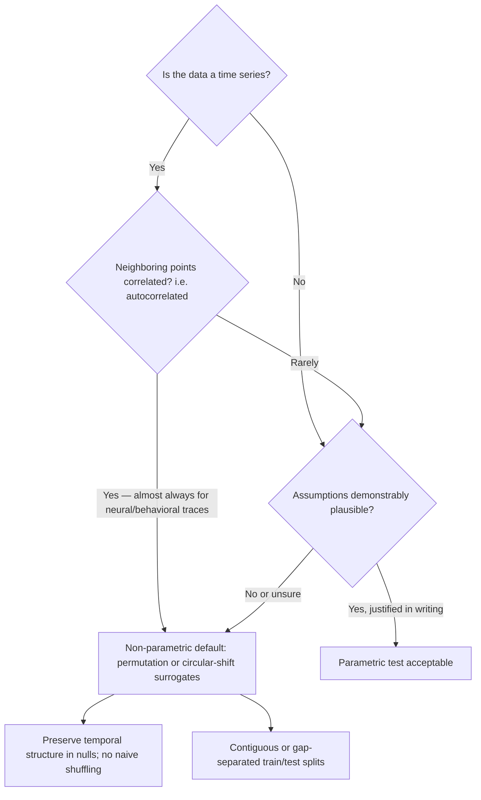

# Methods: What Is Done, What Is Intended, and How to Contribute Safely

*Audience: new contributors, including those new to data science. This document is grounded in the actual code in `tools/`, the tests in `tests/`, the docs in `docs/`, and the open issue list. It does not describe any data-processing pipeline, because the public tree deliberately contains none (see [Methods scope](METHODS_SCOPE.md)).*

## Done

These items exist in the repository today and are covered by synthetic tests.

### 1. Release-boundary scanner (`tools/release_boundary_scan.py`)

A read-only scanner that asks Git for the list of tracked files and checks **only those paths**. It never enumerates untracked files, never touches the network, and never writes anything.

- **Path rules.** Tracked paths are rejected if they fall under excluded areas (`data/`, `results/`, `figures/`, `notebooks/`, `archives/`, and similar) or end in data/notebook/archive suffixes (`.csv`, `.npy`, `.pkl`, `.ipynb`, `.zip`, and similar). Absolute paths and paths containing `..` are reported as unsafe. Tracked symbolic links require review.
- **Text rules.** Decodable tracked text is scanned with regular expressions for network addresses (`https?://`), email addresses, DOI-like identifiers (`10.\d{4,9}/...`), and outcome-style claims. `docs/INTRODUCTION.md`, which legitimately carries the project's verified reference list, is exempted from text scanning.
- **Exit statuses.** `0` = clean, `1` = violations found (each printed as `path: reason`), `2` = Git could not list tracked files (fail-closed: the scan reports unavailability instead of silently scanning nothing).

Covered by `tests/test_release_boundary_scan.py`: safe text accepted; excluded paths and network addresses reported; DOI-like and outcome-style text reported; Git failure surfaced as a `RuntimeError`. Tests patch the Git listing and use temporary directories, so they are fully synthetic.

### 2. Fail-closed deserialization (`tools/restricted_pickle_reader.py`)

Pickle files can encode instructions to import and run arbitrary Python code, so loading an untrusted pickle is a code-execution risk. `RestrictedUnpickler.find_class` **always** raises `pickle.UnpicklingError`, rejecting every global reference rather than maintaining an allowlist that could go stale. Basic structures (dicts, lists, numbers) still load.

Covered by `tests/test_restricted_pickle_reader.py`: a synthetic basic structure round-trips, and a synthetic unsafe payload requesting `os.system` is rejected without being invoked.

### 3. Bounded documentation of completed research

`README.md`, `docs/STATUS_AND_PLAN.md`, `docs/CURRENT_RESULTS_AND_DISCUSSION.md`, and `docs/INTRODUCTION.md` record two completed, **separate** observational analyses (a component–motion encoding route and a distinct prediction route) with qualitative, bounded outcomes and explicit non-claims. `docs/RELEASE_BOUNDARY.md` defines what may appear in the tree; `docs/DEFERRED_AND_DROPPED_DIRECTIONS.md` records what is excluded.

## Intended

These directions are open issues or documented gaps — none are implemented yet, and each has a stated boundary.

- **Synthetic edge-case tests for the scanner** (issues #4 superseded; #9, #10, #11 open): symbolic-link review, unsafe tracked relative paths, and builtins-global rejection. The scanner already *detects* these; what is missing is dedicated synthetic regression tests.
- **Introduction-file exemption test** (issue #8): the `docs/INTRODUCTION.md` text-scan exemption in `scan_tracked_tree` has no dedicated test.
- **Wording clarifications** (issues #12, #13, #14): release-scanner exit-status handling, the held-out interpretation limit, and descriptive link text.
- **Integration reviews** (issues #15, #16, both blocked): integrating new release-scanner synthetic tests and the public documentation boundary review.
- **Scientific-owner gate** (issue #17): planning the owner-approval gate for any future data-dependent work. Per [Methods scope](METHODS_SCOPE.md), any future implementation must remain data-free until the owner approves a separately governed input interface.

## Design decisions and why

**Fail-closed over fail-open.** Both tools choose the conservative default when uncertain: the unpickler rejects *all* globals (an allowlist would need constant maintenance and would authorize code execution on a mistake), and the scanner exits `2` when it cannot enumerate tracked files (silently scanning nothing would look like a pass). Selection rule for future tools: *when a safety check cannot run, report failure loudly rather than succeeding quietly.*

**Git-tracked scope only.** The scanner checks `git ls-files` output rather than walking the filesystem. Why: the release boundary concerns what is *published*, and walking the working tree would flag a developer's local scratch files that will never ship.

**Synthetic tests only.** Every test fixture is constructed in code (temporary directories, in-memory byte streams) and never resembles research material. Why: the release boundary excludes data-dependent tests and forbids tests from writing to data/result/figure/output paths; synthetic fixtures make that structurally guaranteed.

**Routes kept separate.** The two completed analyses are never pooled, because they answer different questions with different designs; pooling would manufacture a synthetic consensus neither route supports.

**Undecided: extending the text-scan exemption list.** Currently only `docs/INTRODUCTION.md` is exempt, so any new doc containing reference URLs (including this one) is flagged for review. Two options: (a) keep one exempt file and require owner review for each new reference-bearing doc — maximally conservative; (b) generalize the exemption to a declared list of reference-bearing docs — less friction, but weaker default. *Selection rule: choose (a) until the owner explicitly approves a list; do not widen exemptions unilaterally.*

**Undecided: doctest vs. unittest for new checks.** The repo standardizes on `unittest` with `python -m unittest discover -s tests -v`. New contributors should follow that convention unless the owner approves a pytest migration; consistency of the validation command in the README outranks individual preference.

## Parametric vs. non-parametric: a decision guide

A *parametric* test (t-test, ordinary least-squares p-values, classical ANOVA) assumes the data follow a specific distribution — usually independent, identically distributed, Gaussian errors. A *non-parametric* test (permutation, bootstrap, circular-shift surrogates) makes weaker assumptions by recomputing the statistic on many re-arrangements of the real data.

**Concrete rules for this project's subject matter:**

1. Neural and behavioral recordings are **autocorrelated time series** — each point resembles its temporal neighbors. Autocorrelated series almost always violate the independence assumption of parametric tests, inflating false discoveries. Default to **permutation or circular-shift (time-shift) surrogate nulls**, which destroy the predictor–response alignment while preserving each series' internal temporal structure.
2. Never shuffle a time series naively: that destroys autocorrelation in the surrogate but not the real data, producing an unrealistically easy null.
3. Keep train/test splits contiguous or gap-separated for time series; random interleaved splits leak information across the held-out boundary.
4. Use parametric tests only when independence and distributional assumptions are demonstrably plausible (for example, summary statistics computed once per independent animal) — and state the justification.
5. When in doubt, prefer the non-parametric default and pre-specify it before inspecting outcomes.

*Note: no statistical test currently runs in this repository — this guide governs how contributors should reason about any future owner-approved analysis and how to review methodological claims in documentation.*

## Hygiene rules every contribution must follow

**Seeds and determinism.** Any randomness in tests must be seeded so runs are reproducible; the existing tests avoid randomness entirely, which is even better. If you add a randomized synthetic fixture, fix the seed and say so in the test name or docstring.

**Synthetic ground truth.** Tests should construct inputs whose correct behavior is known by construction (for example, a pickle payload that provably requests `os.system`, a tracked-path list that provably contains `data/`). Never derive fixtures from real research material — fixtures must not resemble or encode research outputs.

**Surrogate-data nulls.** If a future approved analysis ever quantifies a time-series association, the null distribution must come from surrogates that preserve autocorrelation (circular shifts, block permutation), not from shuffled or parametric defaults. This follows directly from the decision guide above.

**Test discipline.**
- Run `python -m unittest discover -s tests -v` and `python tools/release_boundary_scan.py` before proposing a change (per CONTRIBUTING.md).
- New public callables need Google-style docstrings: summary, arguments, return value, raised exceptions.
- Tests must not access the network, must not read external data, and must not write to repository data/result/figure/download/archive/output paths.
- One test per documented behavior; names read as sentences (`test_rejects_unlisted_global`).
- A scanner exit status of `1` is a request for owner review, not necessarily an error — but do not merge flagged text without review.
- Preserve the documentation distinction between association, prediction, and causation in any wording you touch.

## How to start contributing

Pick an open `good first issue` (currently #8–#14), read the matching source file and its tests, write the smallest change that closes the gap, and verify both validation commands pass. For anything touching the release boundary or future data-dependent work, leave the decision to the project owner (issue #17) rather than expanding scope unilaterally.
