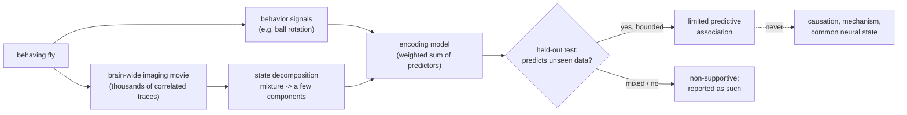

# Concept Figure: From a Brain-Wide Movie to Components and Honest Prediction

This file is the tracked, text-only stand-in for the repository's concept
figure. The public release boundary does not permit image files or figure
directories in the tracked tree (see `tools/release_boundary_scan.py` and
[RELEASE_BOUNDARY.md](RELEASE_BOUNDARY.md)), so the figure is expressed here
as a Mermaid diagram that any Markdown viewer with Mermaid support renders
automatically.

**Caption:** The analysis shape this repository documents. A behaving fly is
recorded brain-wide while behavioral signals are measured; the huge
correlated movie is decomposed into a few compact components; an encoding
model tries to predict components from behavior; and the only verdict that
counts is whether the model predicts observations it was never fitted on.
Every interpretive claim stops at "predictive association" — causation and
mechanism are explicitly out of reach.

Reading the diagram:

1. The raw recording is a **mixture**; decomposition separates it into a
   small set of statistical patterns (components) — a compression step, not
   a discovery of biological modules.
2. The encoding model is just a weighted sum whose weights are chosen to
   minimize prediction error on a training portion — the worked arithmetic
   is in [EXTENDED_INTRODUCTION.md](EXTENDED_INTRODUCTION.md), section 4.
3. **Held-out evaluation** is the honesty device: fit on one part, score on
   a disjoint part the model never saw.
4. The two completed routes recorded here ended exactly at this diagram's
   two verdict boxes: one limited supportive route, one non-supportive
   route, kept separate and never pooled.
